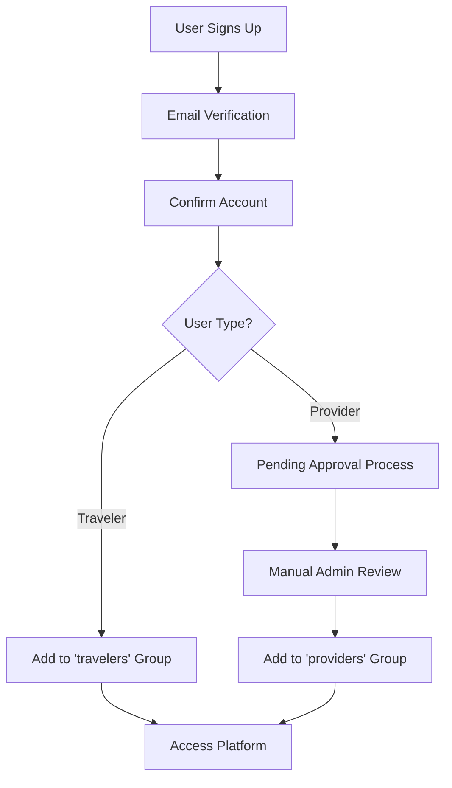

# Authentication System Documentation

## Overview
The YAAN platform uses AWS Cognito with Next.js App Router for secure authentication. Implements HTTP-only cookies for token storage, preventing XSS attacks while enabling SSR capabilities.

## 🏗️ Architecture

### Core Components

#### 1. AWS Cognito Configuration
```typescript
// amplify/outputs.json structure
{
  "auth": {
    "user_pool_id": "us-west-2_xxxxxxxxx",
    "user_pool_client_id": "xxxxxxxxxxxxxxxxx", 
    "identity_pool_id": "us-west-2:xxxxxxxx-xxxx-xxxx-xxxx-xxxxxxxxxxxx",
    "aws_region": "us-west-2",
    "standard_required_attributes": ["email"],
    "username_attributes": ["email"]
  }
}
```

#### 2. Server-Side Configuration
```typescript
// src/app/amplify-config-ssr.ts
import { createServerRunner } from '@aws-amplify/adapter-nextjs';

export const { runWithAmplifyServerContext } = createServerRunner({
  config: outputs
});
```

#### 3. Client-Side Configuration  
```typescript
// src/app/amplify-client-config.tsx
'use client';
import { Amplify } from 'aws-amplify';
import { amplifyConfig } from './amplify-config-ssr';

Amplify.configure(amplifyConfig, { ssr: true });
```

## 🔐 Security Implementation

### HTTP-Only Cookies Strategy
**Why**: Prevents XSS attacks by making tokens inaccessible to JavaScript

```typescript
// Cookie configuration
export const amplifyConfig = {
  ...outputs,
  ssr: true,
  Auth: {
    ...outputs.auth,
    cookieStorage: {
      domain: process.env.NEXT_PUBLIC_COOKIE_DOMAIN || 'localhost',
      path: '/',
      expires: 7, // días
      sameSite: 'lax' as const,
      secure: process.env.NODE_ENV === 'production'
    }
  }
};
```

### Token Management
```typescript
// Server-side token extraction
export async function getIdTokenServer() {
  return await runWithAmplifyServerContext({
    nextServerContext: { cookies },
    operation: async (contextSpec) => {
      try {
        const session = await fetchAuthSession(contextSpec);
        return session.tokens?.idToken?.toString();
      } catch (error) {
        console.error('Failed to get server session:', error);
        return null;
      }
    }
  });
}
```

## 👥 User Types & Groups

### User Roles
1. **Travelers**: Default users who can book experiences
2. **Providers**: Verified tourism businesses who create products
3. **Admins**: Platform administrators

### Cognito Groups
- `travelers` - Default group for all users
- `providers` - Tourism business providers
- `admins` - Platform administrators

### Custom Attributes
```typescript
interface UserAttributes {
  'custom:user_type': 'traveler' | 'provider' | 'admin';
  'custom:business_name'?: string;
  'custom:business_registration'?: string;
  'custom:phone_number'?: string;
  'custom:provider_status'?: 'pending' | 'approved' | 'rejected';
}
```

## 🔄 Authentication Flows

### 1. Registration Flow


### 2. Authentication Check
```typescript
// src/utils/amplify-server-utils.ts
export async function getAuthenticatedUser() {
  return await runWithAmplifyServerContext({
    nextServerContext: { cookies },
    operation: async (contextSpec) => {
      try {
        const user = await getCurrentUser(contextSpec);
        const attributes = await fetchUserAttributes(contextSpec);
        
        return {
          ...user,
          attributes,
          userType: attributes?.['custom:user_type'] || 'traveler',
          isProvider: attributes?.['custom:user_type'] === 'provider',
          isAdmin: attributes?.['custom:user_type'] === 'admin'
        };
      } catch {
        return null;
      }
    }
  });
}
```

### 3. Route Protection
```typescript
// src/middleware.ts
export async function middleware(request: NextRequest) {
  const protectedRoutes = ['/dashboard', '/provider', '/admin'];
  const isProtectedRoute = protectedRoutes.some(route => 
    request.nextUrl.pathname.startsWith(route)
  );

  if (isProtectedRoute) {
    const authenticated = await runWithAmplifyServerContext({
      nextServerContext: { request, response },
      operation: async (contextSpec) => {
        try {
          const session = await fetchAuthSession(contextSpec);
          return !!session.tokens?.idToken;
        } catch {
          return false;
        }
      }
    });

    if (!authenticated) {
      return NextResponse.redirect(new URL('/auth/login', request.url));
    }
  }

  return NextResponse.next();
}
```

## 🎣 Custom Hooks

### useAmplifyAuth Hook
```typescript
// src/hooks/useAmplifyAuth.ts
export function useAmplifyAuth() {
  const [user, setUser] = useState(null);
  const [loading, setLoading] = useState(true);

  useEffect(() => {
    // Listen for auth state changes
    const unsubscribe = Hub.listen('auth', ({ payload }) => {
      switch (payload.event) {
        case 'signedIn':
          fetchCurrentUser();
          break;
        case 'signedOut':
          setUser(null);
          break;
      }
    });

    fetchCurrentUser();
    return unsubscribe;
  }, []);

  const fetchCurrentUser = async () => {
    try {
      const currentUser = await getCurrentUser();
      const attributes = await fetchUserAttributes();
      
      setUser({
        ...currentUser,
        attributes,
        userType: attributes?.['custom:user_type'] || 'traveler'
      });
    } catch (error) {
      setUser(null);
    } finally {
      setLoading(false);
    }
  };

  return {
    user,
    loading,
    isAuthenticated: !!user,
    isProvider: user?.attributes?.['custom:user_type'] === 'provider',
    isAdmin: user?.attributes?.['custom:user_type'] === 'admin'
  };
}
```

## 🛡️ Server Actions Security

### Authentication Wrapper
```typescript
// All server actions follow this pattern
export async function authenticatedServerAction() {
  // 1. Check authentication
  const idToken = await getIdTokenServer();
  if (!idToken) {
    return { success: false, error: 'Usuario no autenticado' };
  }

  // 2. Get user details
  const user = await getAuthenticatedUser();
  if (!user) {
    return { success: false, error: 'No se pudo obtener información del usuario' };
  }

  // 3. Check permissions
  const userType = user.attributes?.['custom:user_type'];
  if (userType !== 'provider') {
    return { success: false, error: 'Permisos insuficientes' };
  }

  // 4. Execute business logic
  // ...
}
```

### GraphQL Integration
```typescript
// Direct AppSync calls with ID token
const response = await fetch(outputs.data.url, {
  method: 'POST',
  headers: {
    'Content-Type': 'application/json',
    'Authorization': idToken,
    'x-api-key': outputs.data.api_key || ''
  },
  body: JSON.stringify({
    query: mutation,
    variables: { input: data }
  })
});
```

## 🔍 Debugging & Monitoring

### Logging Strategy
```typescript
// Structured logging for auth events
console.log('🔑 Authentication Event:', {
  event: 'token_refresh',
  userId: user.sub,
  timestamp: new Date().toISOString(),
  userAgent: request.headers.get('user-agent')
});
```

### Error Handling
```typescript
// Consistent error responses
interface AuthResponse {
  success: boolean;
  user?: User;
  error?: string;
  errorType?: 'auth_failed' | 'permission_denied' | 'token_expired';
}
```

## 🚀 Performance Optimizations

### 1. Session Caching
- Cookies reduce database calls
- Server-side session validation
- Automatic token refresh

### 2. Route-level Optimization
- Middleware-based route protection
- Minimal auth checks on public routes
- Optimized redirect flows

## 📊 Security Headers

### Next.js Configuration
```javascript
// next.config.mjs
const securityHeaders = [
  {
    key: 'X-Content-Type-Options',
    value: 'nosniff'
  },
  {
    key: 'X-Frame-Options', 
    value: 'DENY'
  },
  {
    key: 'X-XSS-Protection',
    value: '1; mode=block'
  },
  {
    key: 'Strict-Transport-Security',
    value: 'max-age=31536000; includeSubDomains'
  }
];
```

## 🧪 Testing Strategy

### Unit Tests
- Auth utility functions
- Custom hooks behavior
- Error handling scenarios

### Integration Tests
- Full auth flows
- Route protection
- Server action security

### E2E Tests
- User registration
- Login/logout flows
- Permission-based access

This authentication system provides enterprise-grade security while maintaining excellent developer experience and performance.