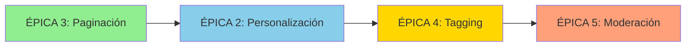

# YAAN Moments - Backend API Contracts

> **Documento de Especificación**: Contracts esperados por el frontend para completar funcionalidades pendientes de YAAN Moments.
>
> **Fecha**: 2025-11-17
> **Versión**: 1.0.0
> **Estado**: Pendiente de implementación backend

---

## Resumen Ejecutivo

Este documento especifica las queries y mutations de GraphQL que el backend debe implementar para completar las épicas pendientes de YAAN Moments identificadas en el análisis del 2025-11-17.

**Estado actual del frontend:**
- ✅ YAAN Moments 100% funcional para flujo principal (Upload → Edit → Publish)
- ✅ ~2,100 líneas de código implementadas y testeadas
- ✅ Server actions listos esperando backend support
- ⚠️ 4 épicas bloqueadas por falta de soporte backend

**Épicas que requieren backend:**
1. **ÉPICA 2** (P1): Personalización de Feed - Queries para `following` y `preferences`
2. **ÉPICA 3** (P2): Paginación Infinita - Soporte de `nextToken` en queries
3. **ÉPICA 4** (P2): Friend Tagging - Campo `taggedUserIds` en schema
4. **ÉPICA 5** (P3): Moderación de Contenido - Mutations `deleteMoment` y `reportContent`

---

## ÉPICA 2: Personalización de Feed (P1 - ALTA)

### Contexto

Actualmente, todos los feed types (`all`, `following`, `preferences`, `user`) usan la misma query `getAllActiveMoments`. Esto significa que todos los usuarios ven el mismo contenido, sin personalización.

**Código actual en frontend:**
```typescript
// src/lib/server/moments-actions.ts:323-328
const queryMap = {
  all: queries.getAllActiveMoments,
  following: queries.getAllActiveMoments, // TODO: Implementar getAllMomentsByFollowing
  preferences: queries.getAllActiveMoments, // TODO: Implementar getAllMomentsByMyPreferences
  user: queries.getAllMomentsByUser
};
```

### Query 1: getAllMomentsByFollowing

**Propósito**: Retornar moments solo de usuarios que el usuario actual sigue.

**GraphQL Schema:**
```graphql
query getAllMomentsByFollowing(
  $limit: Int
  $nextToken: String
) {
  getAllMomentsByFollowing(
    limit: $limit
    nextToken: $nextToken
  ) {
    items {
      id
      userId
      description
      resourceType
      resourceUrl
      tags
      preferences
      destination {
        place
        placeSub
        coordinates {
          latitude
          longitude
        }
      }
      experienceLink
      created_at
      updated_at
      stats {
        likesCount
        commentsCount
        sharesCount
        savesCount
      }
      user_data {
        id
        username
        name
        picture_url
      }
      # Futuro: taggedUsers cuando se implemente ÉPICA 4
    }
    nextToken
  }
}
```

**Lógica backend esperada:**
1. Obtener `userId` del contexto de autenticación (Cognito token)
2. Query a tabla `Connections` para obtener IDs de usuarios seguidos
3. Filtrar moments donde `moment.userId IN (followedUserIds)`
4. Ordenar por `created_at DESC`
5. Aplicar paginación con `limit` y `nextToken`

**Variables de entrada:**
```typescript
{
  limit?: number;      // Default: 20, Max: 50
  nextToken?: string;  // Cursor de paginación
}
```

**Respuesta esperada:**
```typescript
{
  items: Moment[];     // Array de moments de usuarios seguidos
  nextToken?: string;  // Cursor para siguiente página (null si es última)
}
```

---

### Query 2: getAllMomentsByMyPreferences

**Propósito**: Retornar moments que coinciden con las preferencias del usuario (tags/categorías).

**GraphQL Schema:**
```graphql
query getAllMomentsByMyPreferences(
  $limit: Int
  $nextToken: String
) {
  getAllMomentsByMyPreferences(
    limit: $limit
    nextToken: $nextToken
  ) {
    items {
      # ... mismo schema que getAllMomentsByFollowing
    }
    nextToken
  }
}
```

**Lógica backend esperada:**
1. Obtener `userId` del contexto de autenticación
2. Query a tabla `Users` para obtener `preferences` del usuario
3. Filtrar moments donde existe overlap entre:
   - `moment.preferences` Y `user.preferences`
   - OR `moment.tags` Y `user.preferences`
4. Ordenar por relevancia (# de coincidencias) y `created_at DESC`
5. Aplicar paginación con `limit` y `nextToken`

**Algoritmo de scoring (opcional pero recomendado):**
```typescript
score = (
  countOverlap(moment.preferences, user.preferences) * 2 +
  countOverlap(moment.tags, user.preferences) * 1
) / created_at_recency_factor
```

**Variables de entrada:**
```typescript
{
  limit?: number;      // Default: 20, Max: 50
  nextToken?: string;  // Cursor de paginación
}
```

---

### Integración Frontend

**Archivo afectado:** `src/lib/server/moments-actions.ts`

**Cambio requerido:**
```typescript
// ANTES (líneas 323-328)
const queryMap = {
  all: queries.getAllActiveMoments,
  following: queries.getAllActiveMoments, // ❌ TODO
  preferences: queries.getAllActiveMoments, // ❌ TODO
  user: queries.getAllMomentsByUser
};

// DESPUÉS (cuando backend implemente queries)
const queryMap = {
  all: queries.getAllActiveMoments,
  following: queries.getAllMomentsByFollowing, // ✅ Query específica
  preferences: queries.getAllMomentsByMyPreferences, // ✅ Query específica
  user: queries.getAllMomentsByUser
};
```

**Testing requerido:**
1. Usuario A sigue a Usuario B
2. Usuario B publica moment
3. Feed "Siguiendo" de Usuario A debe mostrar moment de B
4. Feed "Siguiendo" de Usuario C (no sigue a B) NO debe mostrar moment de B

---

## ÉPICA 3: Paginación Infinita (P2 - MEDIA)

### Contexto

Actualmente, todas las queries de moments no retornan `nextToken`, limitando el feed a 20 items.

**Código actual en frontend:**
```typescript
// src/lib/server/moments-actions.ts:342
const { data, errors } = await client.graphql({
  query: selectedQuery,
  variables: {
    limit: limit,
    nextToken: nextToken // ⚠️ Backend no retorna nextToken
  }
});
```

### Queries Afectadas

**TODAS las queries de moments deben soportar paginación:**

1. `getAllActiveMoments` ✅ (ya implementada con paginación)
2. `getAllMomentsByFollowing` ⚠️ (nueva query - ver ÉPICA 2)
3. `getAllMomentsByMyPreferences` ⚠️ (nueva query - ver ÉPICA 2)
4. `getAllMomentsByUser` ⚠️ (actualizar para paginación)

### Schema Requerido

**Pattern estándar de paginación:**
```graphql
type MomentConnection {
  items: [Moment!]!
  nextToken: String  # Cursor para siguiente página
}

query getAllActiveMoments(
  $limit: Int
  $nextToken: String
): MomentConnection

query getAllMomentsByUser(
  $userId: ID!
  $limit: Int
  $nextToken: String
): MomentConnection

# ... mismo pattern para todas las queries
```

### Implementación Backend Requerida

**DynamoDB Pagination Pattern:**
```typescript
// Pseudo-código de implementación
async function getAllActiveMoments(limit: number, nextToken?: string) {
  const params = {
    TableName: 'Moments',
    Limit: limit,
    ExclusiveStartKey: nextToken ? JSON.parse(base64Decode(nextToken)) : undefined,
    ScanIndexForward: false, // DESC order
    FilterExpression: 'attribute_exists(id) AND deleted <> :true',
    ExpressionAttributeValues: {
      ':true': true
    }
  };

  const result = await dynamodb.scan(params).promise();

  return {
    items: result.Items,
    nextToken: result.LastEvaluatedKey
      ? base64Encode(JSON.stringify(result.LastEvaluatedKey))
      : null
  };
}
```

**Cursor encoding:**
- DynamoDB `LastEvaluatedKey` → Base64 encode → `nextToken` (string opaco)
- Frontend envía `nextToken` → Backend decode → `ExclusiveStartKey`

### Integración Frontend

**Archivo afectado:** `src/components/moments/MomentsFeed.tsx`

**Cambio requerido:**
```typescript
// Implementar IntersectionObserver para infinite scroll
const loadMore = async () => {
  if (!nextToken || isLoading) return;

  const result = await getMomentsAction(feedType, 20, nextToken);

  if (result.success && result.data) {
    setMoments(prev => [...prev, ...result.data.items]);
    setNextToken(result.data.nextToken);
  }
};

// Detectar cuando usuario llega al bottom del feed
useEffect(() => {
  const observer = new IntersectionObserver(
    entries => {
      if (entries[0].isIntersecting && nextToken) {
        loadMore();
      }
    },
    { threshold: 1.0 }
  );

  if (bottomRef.current) {
    observer.observe(bottomRef.current);
  }

  return () => observer.disconnect();
}, [nextToken, feedType]);
```

**Testing requerido:**
1. Feed con >20 moments
2. Scroll al final del feed debe cargar más
3. Loading spinner debe aparecer mientras carga
4. No debe haber duplicados entre páginas
5. Última página no debe mostrar loading (nextToken = null)

---

## ÉPICA 4: Friend Tagging Backend (P2 - MEDIA)

### Contexto

El frontend ya envía `taggedUserIds` en la mutation `createMoment`, pero el backend no soporta el campo. El código usa `as any` como workaround temporal.

**Código actual en frontend:**
```typescript
// src/lib/server/moments-actions.ts:185-187
...(taggedUserIds.length > 0 && {
  taggedUserIds: taggedUserIds as any  // ⚠️ Futureproof - backend doesn't support yet
})
```

### Schema Changes Required

**Input Type:**
```graphql
input CreateMomentInput {
  description: String!
  resourceType: String!
  resourceUrl: [String!]
  tags: [String!]
  preferences: [String!]
  destination: [DestinationInput!]
  experienceLink: String
  taggedUserIds: [String!]  # ✅ NEW - Array de user IDs a etiquetar
}

input UpdateMomentInput {
  id: ID!
  # ... existing fields
  taggedUserIds: [String!]  # ✅ NEW
}
```

**Output Type:**
```graphql
type Moment {
  id: ID!
  userId: String!
  description: String!
  resourceType: String!
  resourceUrl: [String!]
  tags: [String!]
  preferences: [String!]
  destination: [Destination!]
  experienceLink: String
  taggedUserIds: [String!]  # ✅ NEW - Array de IDs
  taggedUsers: [User!]      # ✅ NEW - Resolver para objetos User completos
  created_at: AWSDateTime!
  updated_at: AWSDateTime!
  # ... existing fields
}

type User {
  id: ID!
  username: String!
  name: String!
  picture_url: String
  # ... other user fields
}
```

### Resolver para taggedUsers

**Implementación esperada:**
```typescript
// Resolver para Moment.taggedUsers
async taggedUsers(parent: Moment, args: any, context: any) {
  if (!parent.taggedUserIds || parent.taggedUserIds.length === 0) {
    return [];
  }

  // Batch fetch de usuarios etiquetados
  const users = await batchGetUsers(parent.taggedUserIds);

  return users.filter(u => u !== null); // Filtrar usuarios eliminados
}
```

**Optimización con DataLoader (recomendado):**
```typescript
const userLoader = new DataLoader(async (userIds: string[]) => {
  const users = await batchGetUsers(userIds);
  return userIds.map(id => users.find(u => u.id === id) || null);
});

// En resolver
const taggedUsers = await Promise.all(
  parent.taggedUserIds.map(id => userLoader.load(id))
);
```

### Validación Backend

**Validaciones requeridas:**
1. `taggedUserIds` debe contener solo IDs válidos de usuarios existentes
2. No permitir etiquetar al mismo usuario múltiples veces (deduplicar)
3. Límite máximo de 20 usuarios etiquetados por moment
4. Usuarios etiquetados deben ser "amigos" del usuario que publica (opcional pero recomendado)

**Ejemplo de validación:**
```typescript
async function validateTaggedUsers(userId: string, taggedUserIds: string[]) {
  // 1. Deduplicar
  const uniqueIds = [...new Set(taggedUserIds)];

  // 2. Límite máximo
  if (uniqueIds.length > 20) {
    throw new Error('Cannot tag more than 20 users');
  }

  // 3. Verificar que usuarios existen
  const users = await batchGetUsers(uniqueIds);
  const validIds = users.filter(u => u !== null).map(u => u.id);

  if (validIds.length !== uniqueIds.length) {
    throw new Error('Some tagged users do not exist');
  }

  // 4. Opcional: Verificar que son amigos
  const connections = await getConnectionsForUser(userId);
  const friendIds = new Set(connections.map(c => c.userId));

  const invalidIds = validIds.filter(id => !friendIds.has(id));
  if (invalidIds.length > 0) {
    throw new Error('Can only tag friends');
  }

  return validIds;
}
```

### Integración Frontend

**Archivo afectado:** `src/lib/server/moments-actions.ts`

**Cambio requerido:**
```typescript
// ANTES (líneas 185-187)
...(taggedUserIds.length > 0 && {
  taggedUserIds: taggedUserIds as any  // ❌ Workaround temporal
})

// DESPUÉS (cuando backend implemente schema)
...(taggedUserIds.length > 0 && {
  taggedUserIds: taggedUserIds  // ✅ Type-safe
})
```

**Actualizar types:**
```typescript
// src/generated/graphql.ts (auto-generado por codegen)
export interface CreateMomentInput {
  description: string;
  resourceType: string;
  resourceUrl?: string[] | null;
  tags?: string[] | null;
  preferences?: string[] | null;
  destination?: DestinationInput[] | null;
  experienceLink?: string | null;
  taggedUserIds?: string[] | null;  // ✅ Type-safe
}
```

### Display de Tagged Users

**Archivo afectado:** `src/components/moments/MomentCard.tsx`

**Funcionalidad a agregar:**
```typescript
// Mostrar usuarios etiquetados debajo de la descripción
{moment.taggedUsers && moment.taggedUsers.length > 0 && (
  <div className="flex items-center gap-1 text-sm text-gray-600">
    <span>con</span>
    {moment.taggedUsers.map((user, index) => (
      <Fragment key={user.id}>
        <Link href={`/profile/${user.username}`} className="font-semibold hover:underline">
          {user.name || user.username}
        </Link>
        {index < moment.taggedUsers.length - 1 && <span>, </span>}
      </Fragment>
    ))}
  </div>
)}
```

**Testing requerido:**
1. Crear moment etiquetando 1 usuario → debe aparecer nombre
2. Crear moment etiquetando 5 usuarios → debe aparecer lista separada por comas
3. Click en nombre etiquetado → debe navegar a perfil
4. Etiquetar usuario que luego se elimina → no debe romper UI

---

## ÉPICA 5: Moderación de Contenido (P3 - BAJA)

### Contexto

El frontend tiene server actions implementadas para `deleteMoment` y `reportContent`, pero las mutations GraphQL no existen en el backend.

**Código actual en frontend:**
```typescript
// src/lib/server/moments-actions.ts:490-513
export async function deleteMomentAction(momentId: string) {
  // ... autenticación ...

  const { data, errors } = await client.graphql({
    query: mutations.deleteMoment, // ❌ Mutation no existe en backend
    variables: { id: momentId }
  });

  // ... handle response ...
}

// src/lib/server/moments-actions.ts:519-544
export async function reportContentAction(input: { itemId, reason, details }) {
  // ... autenticación ...

  const { data, errors } = await client.graphql({
    query: mutations.reportContent, // ❌ Mutation no existe en backend
    variables: { input }
  });

  // ... handle response ...
}
```

### Mutation 1: deleteMoment

**GraphQL Schema:**
```graphql
mutation deleteMoment($id: ID!) {
  deleteMoment(id: $id) {
    success: Boolean!
    message: String
  }
}
```

**Lógica backend esperada:**
```typescript
async function deleteMoment(id: string, context: AuthContext) {
  // 1. Verificar que moment existe
  const moment = await getMomentById(id);
  if (!moment) {
    throw new Error('Moment not found');
  }

  // 2. Verificar permisos
  // - Usuario es dueño del moment
  // - O usuario es admin
  const userId = context.user.sub;
  const isOwner = moment.userId === userId;
  const isAdmin = context.user['custom:user_type'] === 'admin';

  if (!isOwner && !isAdmin) {
    throw new Error('Unauthorized to delete this moment');
  }

  // 3. Soft delete (recomendado) o hard delete
  // Soft delete: Marcar como deleted sin eliminar físicamente
  await updateMoment(id, {
    deleted: true,
    deletedAt: new Date().toISOString(),
    deletedBy: userId
  });

  // 4. Opcional: Eliminar archivos de S3
  if (moment.resourceUrl && moment.resourceUrl.length > 0) {
    await Promise.allSettled(
      moment.resourceUrl.map(path => deleteFromS3(path))
    );
  }

  return { success: true, message: 'Moment deleted successfully' };
}
```

**Soft delete vs Hard delete:**

| Aspecto | Soft Delete | Hard Delete |
|---------|-------------|-------------|
| **Implementación** | `deleted: true` flag | DynamoDB DeleteItem |
| **Recuperación** | Posible (undelete) | Imposible |
| **Auditoría** | Completa | Pérdida de historia |
| **Storage** | Acumula datos | Limpia storage |
| **Recomendación** | ✅ Usar en producción | ❌ Solo para testing |

---

### Mutation 2: reportContent

**GraphQL Schema:**
```graphql
input ReportContentInput {
  itemId: ID!          # ID del moment/comment a reportar
  itemType: String!    # "moment" o "comment"
  reason: String!      # Categoría de reporte
  details: String      # Detalles adicionales (opcional)
}

mutation reportContent($input: ReportContentInput!) {
  reportContent(input: $input) {
    success: Boolean!
    message: String
    reportId: ID        # ID del reporte creado
  }
}
```

**Lógica backend esperada:**
```typescript
async function reportContent(input: ReportContentInput, context: AuthContext) {
  const { itemId, itemType, reason, details } = input;

  // 1. Validar que item existe
  let item;
  if (itemType === 'moment') {
    item = await getMomentById(itemId);
  } else if (itemType === 'comment') {
    item = await getCommentById(itemId);
  }

  if (!item) {
    throw new Error(`${itemType} not found`);
  }

  // 2. Verificar que usuario no está reportando su propio contenido
  const reporterId = context.user.sub;
  if (item.userId === reporterId) {
    throw new Error('Cannot report your own content');
  }

  // 3. Verificar que usuario no ha reportado este item antes
  const existingReport = await getReport({
    itemId,
    reporterId
  });

  if (existingReport) {
    throw new Error('You have already reported this content');
  }

  // 4. Crear reporte en tabla Reports
  const report = await createReport({
    id: generateUUID(),
    itemId,
    itemType,
    reason,
    details,
    reporterId,
    reportedUserId: item.userId,
    status: 'pending', // pending, reviewed, resolved
    createdAt: new Date().toISOString()
  });

  // 5. Incrementar contador de reportes en item
  await incrementReportCount(itemId, itemType);

  // 6. Auto-moderación: Si item tiene >=5 reportes, ocultarlo temporalmente
  const reportCount = await getReportCount(itemId, itemType);
  if (reportCount >= 5) {
    await updateItem(itemId, itemType, { hidden: true });

    // Notificar a equipo de moderación
    await sendModerationAlert({
      itemId,
      itemType,
      reportCount
    });
  }

  return {
    success: true,
    message: 'Content reported successfully',
    reportId: report.id
  };
}
```

**Categorías de reporte (validar en backend):**
```typescript
const VALID_REPORT_REASONS = [
  'spam',
  'inappropriate',
  'harassment',
  'violence',
  'hate_speech',
  'false_information',
  'copyright',
  'other'
];
```

### Database Schema para Reports

**Tabla: Reports**
```typescript
interface Report {
  id: string;              // UUID
  itemId: string;          // ID del moment/comment reportado
  itemType: 'moment' | 'comment';
  reason: string;          // Categoría de reporte
  details?: string;        // Detalles opcionales
  reporterId: string;      // User ID quien reporta
  reportedUserId: string;  // User ID del dueño del contenido
  status: 'pending' | 'reviewed' | 'resolved' | 'dismissed';
  createdAt: string;       // ISO timestamp
  reviewedAt?: string;     // ISO timestamp
  reviewedBy?: string;     // Admin user ID
  resolution?: string;     // Acción tomada
}

// GSI para queries eficientes
{
  PK: `REPORT#${itemId}`,
  SK: `REPORTER#${reporterId}`,
  GSI1PK: `STATUS#${status}`,
  GSI1SK: `CREATED#${createdAt}`
}
```

### Integración Frontend

**Archivo afectado:** `src/components/moments/MomentCard.tsx`

**UI de moderación:**
```typescript
// 3-dot menu en MomentCard
<button onClick={() => setShowMenu(!showMenu)}>
  <MoreVertical className="w-5 h-5" />
</button>

{showMenu && (
  <div className="absolute right-0 top-8 bg-white shadow-lg rounded-lg">
    {isOwnMoment ? (
      <button onClick={handleDelete} className="text-red-600">
        Eliminar momento
      </button>
    ) : (
      <button onClick={() => setShowReportModal(true)} className="text-red-600">
        Reportar contenido
      </button>
    )}
  </div>
)}

{/* Modal de reporte */}
{showReportModal && (
  <ReportModal
    itemId={moment.id}
    itemType="moment"
    onSubmit={handleReport}
    onClose={() => setShowReportModal(false)}
  />
)}
```

**Testing requerido:**
1. Usuario reporta moment → debe crear reporte y mostrar confirmación
2. Usuario reporta mismo moment 2 veces → debe mostrar error
3. Moment con 5+ reportes → debe ocultarse automáticamente
4. Admin ve dashboard de reportes → debe mostrar todos los pending
5. Usuario elimina su propio moment → debe desaparecer del feed

---

## Priorización y Timeline

### Prioridad de Implementación

| Épica | Prioridad | Impacto UX | Esfuerzo Backend | Timeline Sugerido |
|-------|-----------|------------|------------------|-------------------|
| **ÉPICA 3** | P1 | Alto | Bajo (1-2 días) | Sprint actual |
| **ÉPICA 2** | P1 | Alto | Medio (3-4 días) | Sprint actual |
| **ÉPICA 4** | P2 | Medio | Medio (2-3 días) | Próximo sprint |
| **ÉPICA 5** | P3 | Bajo | Alto (4-5 días) | Sprint futuro |

**Razón de priorización:**
- **ÉPICA 3 primero**: Paginación es fundamental para escalar (>20 moments)
- **ÉPICA 2 segundo**: Personalización mejora engagement significativamente
- **ÉPICA 4 tercero**: Tagging es feature social importante pero no bloqueante
- **ÉPICA 5 último**: Moderación es crítica pero puede esperar a tener más contenido

### Dependencies



**Explicación:**
- ÉPICA 3 es base para todas las demás (paginación universal)
- ÉPICA 2 depende de ÉPICA 3 (feed personalizado con paginación)
- ÉPICA 4 independiente pero se beneficia de ÉPICA 2 (tagged users en feed)
- ÉPICA 5 independiente pero se beneficia de toda la funcionalidad previa

---

## Testing & Validation

### Contract Testing

**Recomendado**: Implementar contract tests para validar que backend cumple con specs.

**Ejemplo con Jest:**
```typescript
describe('ÉPICA 2: Feed Personalizado', () => {
  test('getAllMomentsByFollowing retorna solo moments de usuarios seguidos', async () => {
    // Arrange
    const userA = await createTestUser();
    const userB = await createTestUser();
    await createConnection(userA.id, userB.id); // A sigue a B

    const momentByB = await createMoment({ userId: userB.id });
    const momentByC = await createMoment({ userId: 'userC' });

    // Act
    const result = await getAllMomentsByFollowing(userA.id);

    // Assert
    expect(result.items).toContainEqual(expect.objectContaining({ id: momentByB.id }));
    expect(result.items).not.toContainEqual(expect.objectContaining({ id: momentByC.id }));
  });
});
```

### Integration Testing

**Scenarios críticos a testear:**

**ÉPICA 2:**
- [ ] Feed "Siguiendo" solo muestra moments de conexiones
- [ ] Feed "Preferencias" muestra moments relevantes con scoring correcto
- [ ] Feed vacío cuando usuario no sigue a nadie / no tiene preferencias

**ÉPICA 3:**
- [ ] Paginación retorna páginas sin duplicados
- [ ] NextToken = null en última página
- [ ] Limit se respeta correctamente
- [ ] Performance <500ms para página de 20 items

**ÉPICA 4:**
- [ ] TaggedUserIds se persisten correctamente
- [ ] Resolver taggedUsers retorna objetos User completos
- [ ] Validación rechaza usuarios inexistentes
- [ ] Validación rechaza >20 usuarios etiquetados

**ÉPICA 5:**
- [ ] DeleteMoment soft-deletes correctamente
- [ ] ReportContent crea reporte y incrementa contador
- [ ] Auto-ocultamiento con 5+ reportes funciona
- [ ] Usuario no puede reportar mismo contenido 2 veces

---

## Referencias

**Documentación relacionada:**
- [CLAUDE.md](../CLAUDE.md) - Sección "YAAN Moments Feature" (líneas 2145-2872)
- [MOMENTS-IMPLEMENTATION.md](./MOMENTS-IMPLEMENTATION.md) - Implementación técnica detallada
- [GraphQL Operations](../src/graphql/operations/) - Queries y mutations actuales

**Contactos:**
- Frontend Lead: Claude Code
- Backend Team: [TBD]
- Product Owner: [TBD]

---

## Changelog

| Versión | Fecha | Cambios |
|---------|-------|---------|
| 1.0.0 | 2025-11-17 | Documento inicial con 4 épicas backend |

---

**Generado automáticamente por Claude Code basado en análisis exhaustivo del código frontend.**
