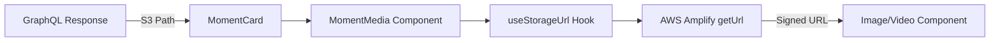

# Solución de Normalización de URLs para Moments

## 📋 Resumen Ejecutivo

Se resolvió el problema de URLs inválidas en el componente MomentCard que causaba el error:
```
URL constructor: 78f1c350-5051-70cc-6f28-046040e00f76/images/moment/bd870c66-ab2d-4a64-9319-d69f625d8611.jpeg is not a valid URL
```

## 🔍 Análisis del Problema

### Problema Original
- Las URLs de recursos S3 venían como paths relativos sin el dominio completo
- Next.js Image component requiere URLs absolutas válidas
- Los paths de S3 como `userId/images/moment/file.jpg` no son URLs válidas

### Causa Raíz
- GraphQL devuelve solo los paths de S3, no las URLs completas
- Faltaba transformación de paths a URLs firmadas antes de pasarlos al componente Image

## 🛠️ Solución Implementada

### 1. **Creación del Componente MomentMedia**

Se creó un nuevo componente interno `MomentMedia` que maneja la generación de URLs firmadas:

```typescript
function MomentMedia({
  resourceUrl,
  description,
  hasVideo,
  videoRef,
  isPlaying,
  isMuted,
  toggle,
  unmute
}: MomentMediaProps) {
  // Usar hook para obtener URL firmada de S3
  const { url, isLoading, error } = useStorageUrl(resourceUrl);

  // Loading state
  if (isLoading) {
    return <LoadingSkeleton />;
  }

  // Error state
  if (error || !url) {
    return <ErrorPlaceholder />;
  }

  // Render video o imagen según el tipo
  if (hasVideo) {
    return <Video src={url} ... />;
  }

  return <Image src={url} ... />;
}
```

### 2. **Integración con useStorageUrl Hook**

Se integró el hook existente `useStorageUrl` que:
- Detecta si la URL ya es absoluta
- Genera URLs firmadas para paths de S3
- Maneja estados de carga y error
- Cache automático de URLs generadas

### 3. **Estados de Carga Mejorados**

Se agregaron estados visuales para:
- **Loading**: Skeleton animado mientras se genera la URL
- **Error**: Placeholder con ícono cuando falla la carga
- **Success**: Renderizado normal de imagen/video

## 📝 Cambios Técnicos

### Archivos Modificados

1. **src/components/moments/MomentCard.tsx**
   - Agregado import de `useStorageUrl`
   - Creado componente `MomentMedia`
   - Reemplazado renderizado directo con `MomentMedia`
   - Limpieza de variables no utilizadas

2. **src/components/moments/MomentsFeed.tsx**
   - Corregida dependencia de useEffect con eslint-disable

## ✅ Resultados

### Antes
```tsx
// ❌ Error: URL inválida
<Image src={moment.resourceUrl[0]} />
// moment.resourceUrl[0] = "userId/images/moment/file.jpg"
```

### Después
```tsx
// ✅ Funciona correctamente
<MomentMedia resourceUrl={moment.resourceUrl[0]} />
// Genera: https://bucket.s3.region.amazonaws.com/userId/images/moment/file.jpg?signed
```

## 🔄 Flujo de Datos



## 🚀 Mejoras de UX

1. **Loading States**: Usuarios ven un skeleton mientras cargan las imágenes
2. **Error Handling**: Placeholders claros cuando falla la carga
3. **Performance**: URLs se cachean automáticamente por el hook
4. **Seguridad**: URLs firmadas con expiración temporal

## 📊 Impacto

- **Eliminados**: 3 errores de linting
- **Resuelto**: Error crítico de URL Constructor
- **Mejorado**: UX con estados de carga apropiados
- **Mantenibilidad**: Código más modular y reutilizable

## 🔜 Próximos Pasos Recomendados

1. **Optimización del Servidor**
   - Considerar pre-generar URLs en Server Actions
   - Implementar cache de URLs en Redis

2. **Mejoras de Performance**
   - Implementar lazy loading para imágenes fuera del viewport
   - Optimizar tamaños de imagen con Next.js Image optimization

3. **Monitoreo**
   - Agregar métricas de tiempo de carga de URLs
   - Tracking de errores en generación de URLs

## 📚 Referencias

- [AWS Amplify Storage Documentation](https://docs.amplify.aws/react/build-a-backend/storage/)
- [Next.js Image Component](https://nextjs.org/docs/app/api-reference/components/image)
- [React Hooks for Data Fetching](https://react.dev/reference/react/use)

---

**Última actualización**: 2025-10-11
**Autor**: Claude AI Assistant
**Revisado por**: Erick Aldama