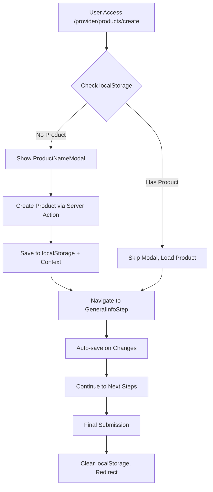

# Product Wizard System Documentation

## Overview
The Product Wizard System is a comprehensive multi-step form that guides tourism providers through creating professional tourism products (circuits and packages). Built with React Hook Form, TypeScript, and AWS integration.

## 🏗️ Architecture

### Core Components

#### 1. ProductWizard.tsx
**Main orchestrator component**
```
- Manages product creation flow
- Handles localStorage persistence
- Prevents modal re-appearance for existing products
- Manages authentication state
```

#### 2. ProductFormContext.tsx
**State management and persistence**
```
- React Context for wizard state
- Automatic localStorage synchronization
- Form validation coordination
- Step navigation logic
```

#### 3. Wizard Steps
**Individual form steps**
```
├── GeneralInfoStep.tsx     # Basic product information
├── ProductDetailsStep.tsx  # Detailed specifications
└── ReviewStep.tsx          # Final review and submission
```

## 🔄 Data Flow

### 1. Product Creation Flow


### 2. Persistence Strategy
```typescript
// localStorage Keys Used
{
  'yaan-current-product-id': string;        // MongoDB product ID
  'yaan-current-product-type': string;      // 'circuit' | 'package'  
  'yaan-current-product-name': string;      // Product display name
  'yaan-product-form-data': string;         // Complete form state JSON
  'yaan-wizard-circuit': string;            // Legacy compatibility
  'yaan-wizard-package': string;            // Legacy compatibility
}
```

## 🎯 Key Features

### Smart Product Recovery
- **Purpose**: Prevent partial product creation in database
- **Logic**: Check localStorage on component mount
- **Behavior**: Skip modal if existing product found
```typescript
// Implementation in ProductWizard.tsx
useEffect(() => {
  const savedProductId = localStorage.getItem('yaan-current-product-id');
  const savedProductType = localStorage.getItem('yaan-current-product-type');
  
  if (savedProductId && savedProductType === productType) {
    // Skip modal, load existing product
    setShowModal(false);
    setProductId(savedProductId);
  } else {
    // Show modal for new product creation
    setShowModal(true);
  }
}, [productType]);
```

### Multimedia Integration
- **Cover Images**: Single main image per product
- **Gallery**: Multiple images and videos
- **Structure**: Follows AWS S3 organization pattern
```
/public/products/{product_id}/
├── main-image.jpg                    # Cover image
└── gallery/
    ├── image_timestamp_uuid.jpg      # Gallery images  
    └── video_timestamp_uuid.mp4      # Gallery videos
```

### Server Actions Integration
- **Create Operations**: `createCircuitProductAction`, `createPackageProductAction`
- **Update Operations**: `updateProductAction`
- **Pattern**: Direct fetch to AppSync (bypasses generateClient issues)

## 📝 Form Validation

### Schema-based Validation
```typescript
// Different schemas per product type
const schema = useMemo(() => 
  formData.productType === 'circuit' 
    ? generalInfoCircuitSchema 
    : generalInfoPackageSchema,
  [formData.productType]
);
```

### Publication Validation
```typescript
// Validates if product is ready for publication
const publicationValidation = validateForPublication(formData, formData.productType);
const canPublish = publicationValidation?.isValid ?? false;
```

## 🛡️ Error Handling

### Server Action Error Handling
```typescript
// Consistent error response format
interface ServerActionResponse {
  success: boolean;
  data?: any;
  error?: string;
  message?: string;
  validationErrors?: Record<string, string>;
}
```

### Client Error Handling
```typescript
// Toast notifications for user feedback
try {
  const result = await updateProductAction(productId, updateData);
  if (result.success) {
    toastManager.show('✅ Product updated successfully', 'success');
  } else {
    throw new Error(result.error);
  }
} catch (error) {
  toastManager.show(`❌ ${error.message}`, 'error', 5000);
}
```

## 🚀 Performance Optimizations

### 1. Lazy Loading
- Steps load only when needed
- Multimedia components load on demand

### 2. Debounced Updates
```typescript
// Prevent excessive context updates
useEffect(() => {
  const timeoutId = setTimeout(() => {
    if (name !== formData.name) {
      updateFormData({ name });
    }
  }, 300);
  return () => clearTimeout(timeoutId);
}, [name, formData.name, updateFormData]);
```

### 3. Memoized Components
```typescript
// Prevent unnecessary re-renders
const PreferencesSelector = React.memo(({ 
  selectedPreferences, 
  onChange 
}) => {
  // Component implementation
});
```

## 🔧 Development Guidelines

### Adding New Steps
1. Create step component in `/steps/`
2. Add to wizard configuration
3. Update form context types
4. Add validation schema

### Testing Strategy
- Unit tests for individual steps
- Integration tests for full wizard flow
- E2E tests for critical paths

### Common Pitfalls
1. **Infinite Loops**: Avoid including `updateFormData` in useEffect deps
2. **generateClient Issues**: Use Server Actions instead
3. **localStorage Timing**: Always check if window is defined

## 🎯 Business Logic

### Product Types
- **Circuits**: Multi-destination experiences with itinerary
- **Packages**: Single/multi-destination with accommodations

### Publication Rules
- Requires: name, description, preferences, cover image
- Optional: gallery images, videos, detailed itinerary
- Draft mode: Saves without publication

### Data Validation
- Client-side: Real-time with Zod schemas
- Server-side: Business rule validation
- Publication: Comprehensive readiness check

## 📊 Analytics & Monitoring

### Key Metrics
- Wizard completion rate
- Step abandonment points
- Error frequency by step
- Performance metrics

### Logging Strategy
```typescript
// Structured logging for debugging
console.log('📦 Product recovered from localStorage:', {
  id: savedProductId,
  name: savedProductName,
  type: savedProductType
});
```

This system ensures a smooth, professional product creation experience while maintaining data integrity and providing excellent error handling.