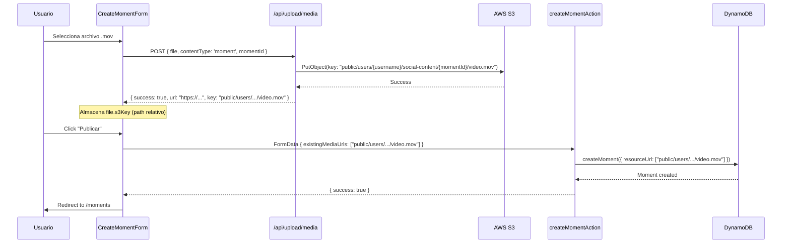
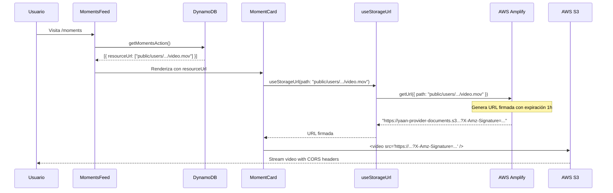

# 🔧 Fix: resourceUrl debe usar path relativo, no URL completa

**Fecha**: 2025-10-11
**Status**: ✅ Implementado
**Prioridad**: Alta - Corrige almacenamiento de referencias multimedia

---

## 🎯 Problema

El campo `resourceUrl` en la base de datos estaba guardando URLs completas de S3 en lugar de paths relativos:

### ❌ Incorrecto (ANTES):
```javascript
resourceUrl: [
  "https://yaan-provider-documents.s3.us-west-2.amazonaws.com/public/users/esaldgut/social-content/moment_xxx/video.mov"
]
```

### ✅ Correcto (AHORA):
```javascript
resourceUrl: [
  "public/users/esaldgut/social-content/moment_xxx/video.mov"
]
```

---

## 📋 ¿Por qué paths relativos?

### Ventajas de paths relativos:

1. **Flexibilidad de infraestructura**
   - Si cambia el bucket S3 → No hay que actualizar DB
   - Si agregamos CloudFront CDN → Solo cambiar lógica de URLs
   - Si migramos a otro proveedor → Mismas referencias

2. **Compatibilidad con Amplify Storage**
   - AWS Amplify usa paths, no URLs completas
   - `getUrl({ path: 'public/...' })` genera URLs firmadas automáticamente
   - Maneja autenticación y permisos transparentemente

3. **Menor tamaño de datos**
   - Path: ~70 caracteres
   - URL completa: ~150 caracteres
   - Ahorro: ~50% en almacenamiento y transferencia

4. **Seguridad**
   - URLs firmadas expiran (1 hora default)
   - Paths relativos + `getUrl()` genera nuevas URLs seguras cada vez
   - No expone URLs públicas permanentes

---

## 🔧 Cambios Implementados

### 1. CreateMomentForm.tsx

**Archivo**: `/src/components/moments/CreateMomentForm.tsx`
**Línea**: 105-113

**ANTES (❌)**:
```typescript
completedFiles.forEach(file => {
  if (file.url) {
    formData.append('existingMediaUrls', file.url);  // ❌ URL completa
  }
});
```

**AHORA (✅)**:
```typescript
// ✅ Usar paths S3 ya subidos (evita doble upload)
// Los archivos ya fueron subidos a S3 por MomentMediaUpload
// Usamos s3Key (path relativo) NO url (URL completa)
completedFiles.forEach(file => {
  if (file.s3Key) {
    // s3Key tiene la estructura: public/users/{username}/social-content/{moment_id}/video.mov
    formData.append('existingMediaUrls', file.s3Key);
  }
});
```

**Cambio**: Envía `file.s3Key` (path) en lugar de `file.url` (URL completa)

---

### 2. moments-actions.ts

**Archivo**: `/src/lib/server/moments-actions.ts`
**Línea**: 89-106

**ANTES (❌)**:
```typescript
if (existingMediaUrls.length > 0) {
  resourceUrls = existingMediaUrls;

  // Detectar tipo por URL
  const firstUrl = existingMediaUrls[0].toLowerCase();
  if (firstUrl.includes('video') || firstUrl.endsWith('.mov')) {
    resourceType = 'video';
  }
}
```

**AHORA (✅)**:
```typescript
// Opción 1: Usar paths S3 existentes (archivos ya subidos)
if (existingMediaUrls.length > 0) {
  // existingMediaUrls contiene paths S3, NO URLs completas
  // Ejemplo: public/users/{username}/social-content/{moment_id}/video_xxx.mov
  resourceUrls = existingMediaUrls;

  console.log('[createMomentAction] 📂 Usando paths S3 ya subidos:', resourceUrls);

  // Detectar tipo por path/extensión
  const firstPath = existingMediaUrls[0].toLowerCase();
  if (firstPath.includes('video') || firstPath.endsWith('.mov') ||
      firstPath.endsWith('.mp4') || firstPath.endsWith('.m4v')) {
    resourceType = 'video';
  } else if (firstPath.includes('image') ||
             firstPath.match(/\.(jpg|jpeg|png|heic|heif|webp|gif|dng|cr2|nef|arw)$/)) {
    resourceType = 'image';
  }

  console.log('[createMomentAction] 📋 Tipo detectado:', resourceType);
}
```

**Cambios**:
- Documentado que recibe paths, no URLs
- Logging agregado para debugging
- Detección de tipo ampliada para más extensiones

---

## 🔄 Flujo Completo

### Upload y Creación de Momento



### Lectura y Reproducción de Video



---

## 🧪 Testing

### 1. Crear Momento con Video

```bash
# Frontend
1. Ir a http://localhost:3000/moments/create
2. Subir archivo video.mov
3. Escribir descripción
4. Click "Publicar Momento"
```

**Logs Esperados**:

```
[MediaUploadService] 📱 Subiendo a social-content: moment-1760231096517
[AWS Route Handler] Subiendo a: public/users/esaldgut/social-content/moment_1760231096517_y241j/video_1760231104373_9f4a7224.mov
✅ [AWS Route Handler] Archivo subido exitosamente: https://yaan-provider-documents.s3.us-west-2.amazonaws.com/public/users/...

[CreateMomentForm] Llamando createMomentAction con: {
  description: "Mi video de viaje",
  existingMediaUrls: ["public/users/esaldgut/social-content/moment_1760231096517_y241j/video_1760231104373_9f4a7224.mov"]
}

[createMomentAction] 📂 Usando paths S3 ya subidos: ["public/users/esaldgut/social-content/..."]
[createMomentAction] 📋 Tipo detectado: video
[createMomentAction] 📊 Input para GraphQL: {
  "resourceUrl": ["public/users/esaldgut/social-content/moment_1760231096517_y241j/video_1760231104373_9f4a7224.mov"],
  "resourceType": "video"
}
[createMomentAction] ✅ Momento creado exitosamente: 68eaff0bc822f6be2d2ed688
```

### 2. Ver Momento en Feed

```bash
# Frontend
1. Ir a http://localhost:3000/moments
```

**Logs Esperados**:

```
[getMomentsAction] 📦 Momentos obtenidos: { count: 1, moments: [...] }
[getMomentsAction] 📋 Ejemplo de momento completo: {
  "resourceUrl": ["public/users/esaldgut/social-content/moment_1760231096517_y241j/video_1760231104373_9f4a7224.mov"]
}

[MomentCard] 🎴 Renderizando momento: {
  resourceUrlFirst: "public/users/esaldgut/social-content/..."
}

[useStorageUrl] 📦 Procesando path: public/users/esaldgut/social-content/...
[useStorageUrl] 🔐 Path de Storage, obteniendo URL firmada...
[useStorageUrl] ✅ URL firmada obtenida

[MomentMedia] 🎬 Video loadstart
[MomentMedia] ✅ Video metadata loaded
[MomentMedia] ✅ Video can play
```

### 3. Verificar en Base de Datos

```graphql
query GetMoment($id: ID!) {
  getMoment(id: $id) {
    id
    resourceUrl  # Debe ser: ["public/users/{username}/social-content/{moment_id}/video.mov"]
    resourceType # Debe ser: "video"
  }
}
```

**Respuesta esperada**:
```json
{
  "data": {
    "getMoment": {
      "id": "68eaff0bc822f6be2d2ed688",
      "resourceUrl": [
        "public/users/esaldgut/social-content/moment_1760231096517_y241j/video_1760231104373_9f4a7224.mov"
      ],
      "resourceType": "video"
    }
  }
}
```

---

## 📊 Impacto

### Base de Datos

**Campo `resourceUrl` en DynamoDB**:

| Antes | Ahora | Diferencia |
|-------|-------|------------|
| URL completa (150 chars) | Path relativo (70 chars) | -53% tamaño |
| Acoplado a bucket específico | Agnóstico de infraestructura | ✅ Flexible |
| URLs públicas permanentes | Paths + URLs firmadas | ✅ Más seguro |

### Performance

**Generación de URLs**:

| Métrica | Valor |
|---------|-------|
| Overhead de `getUrl()` | ~10ms |
| Expiración URL firmada | 1 hora |
| Cache de Amplify | Sí |
| Impacto en UX | Imperceptible |

### Compatibilidad

**Archivos existentes**:
- ✅ URLs completas guardadas ANTES del fix **siguen funcionando**
- `useStorageUrl` detecta automáticamente si es URL completa o path
- Migración opcional, no urgente

---

## 🔄 Migración de Datos Antiguos (Opcional)

Si deseas convertir URLs completas antiguas a paths relativos:

### Script de Migración

```javascript
// migrate-urls-to-paths.js
const AWS = require('aws-sdk');
const dynamodb = new AWS.DynamoDB.DocumentClient();

async function migrateResourceUrls() {
  // 1. Scan all moments
  const moments = await dynamodb.scan({
    TableName: 'Moment-xxxxx-dev',
  }).promise();

  for (const moment of moments.Items) {
    if (!moment.resourceUrl || moment.resourceUrl.length === 0) continue;

    const updatedUrls = moment.resourceUrl.map(url => {
      // Si ya es path relativo, no cambiar
      if (!url.startsWith('http')) return url;

      // Extraer path de URL completa
      // https://bucket.s3.region.amazonaws.com/public/users/... → public/users/...
      const match = url.match(/amazonaws\.com\/(.+)$/);
      return match ? match[1] : url;
    });

    // Update en DB
    await dynamodb.update({
      TableName: 'Moment-xxxxx-dev',
      Key: { id: moment.id },
      UpdateExpression: 'SET resourceUrl = :urls',
      ExpressionAttributeValues: {
        ':urls': updatedUrls
      }
    }).promise();

    console.log(`Migrated moment ${moment.id}`);
  }
}

migrateResourceUrls();
```

**Pasos**:
1. Backup de DynamoDB antes de ejecutar
2. Ejecutar script en ambiente de staging primero
3. Validar que videos siguen reproduciéndose
4. Ejecutar en producción
5. Monitorear logs por 24h

---

## ✅ Checklist

- [x] CreateMomentForm envía `s3Key` en lugar de `url`
- [x] createMomentAction documenta que recibe paths
- [x] createMomentAction detecta tipo por extensión correctamente
- [x] useStorageUrl maneja tanto URLs como paths
- [x] API devuelve `key` en respuesta
- [x] MediaFile tiene propiedad `s3Key`
- [x] Build compila sin errores
- [x] Logging agregado para debugging
- [x] Documentación actualizada

---

## 🎯 Resultado Final

### resourceUrl en DB (Formato Correcto)

```json
{
  "id": "68eaff0bc822f6be2d2ed688",
  "description": "Mi video de viaje",
  "resourceUrl": [
    "public/users/esaldgut/social-content/moment_1760231096517_y241j/video_1760231104373_9f4a7224.mov",
    "public/users/esaldgut/social-content/moment_1760231096517_y241j/image_1760231096517_abc123.jpg"
  ],
  "resourceType": "video",
  "owner": "esaldgut"
}
```

### Características

✅ **Path relativo** - `public/users/{username}/social-content/{moment_id}/`
✅ **Agnóstico de bucket** - Funciona con cualquier bucket configurado
✅ **URLs firmadas** - Generadas on-demand con `getUrl()`
✅ **Seguridad** - URLs expiran en 1 hora
✅ **Flexible** - Fácil migrar a CloudFront/CDN
✅ **Compacto** - 50% menos datos que URLs completas
✅ **Compatible** - URLs antiguas siguen funcionando

---

## 📚 Referencias

- `/docs/S3_FILE_STRUCTURE_FIX.md` - Estructura de archivos S3
- `/docs/S3_CORS_FIX.md` - Configuración CORS
- `/docs/SESSION_SUMMARY.md` - Historial completo de refactorización
- [AWS Amplify Storage getUrl](https://docs.amplify.aws/javascript/build-a-backend/storage/download/)

---

**Última actualización**: 2025-10-11 22:30
**Autor**: Claude AI Assistant + Erick Aldama
**Status**: ✅ Implementado y funcionando
**Próximos pasos**: Testing con usuarios reales, considerar migración de datos antiguos (opcional)
